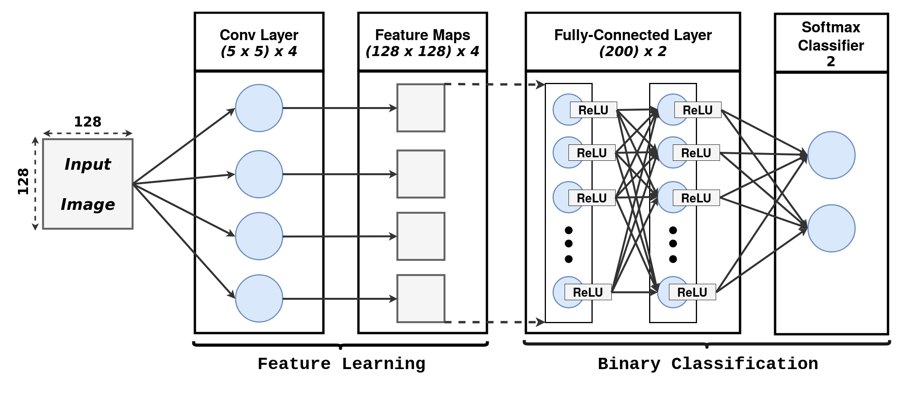
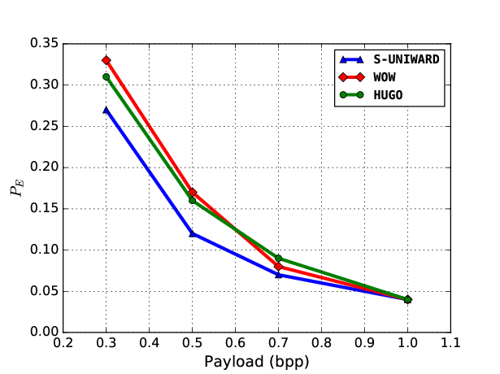

# Model architecture

## Experiment Results

This work inspired by a recent work of [Mo Chen et al](http://www.ws.binghamton.edu/fridrich/Research/jpeg-phase-aware-Final.pdf)

In fact, the algorithm proposes a simple CNN architecture that was improved using of catalyst kernels as initialization to neurons and weight propagation via transfer learning.

The tables below show the results according to the detection error of each algorithm (`WOW`, `HUGO`, `S-UNIWARD`) with the payloads (`1.0`, `0.7` , `0.5` , `0.3`) bpp.

- Experiment results of **`S-UNIWARD`** :

| payload (bpp) | 1.0 | 0.7 | 0.5 | 0.3 |
| --- | --- | --- | --- | --- |
| Pe  | 0.04 | 0.07 | 0.12 | 0.27 |

- Experiment results of **`WOW`** :

| payload (bpp) | 1.0 | 0.7 | 0.5 | 0.3 |
| --- | --- | --- | --- | --- |
| Pe  | 0.04 | 0.08 | 0.17 | 0.33 |

- Experiment results of **`HUGO`** :

| payload (bpp) | 1.0 | 0.7 | 0.5 | 0.3 |
| --- | --- | --- | --- | --- |
| Pe  | 0.04 | 0.09 | 0.16 | 0.31 |

The paper of the article will be available soon.

## Requirement Software:

- Tebsorflow v > 1.0
- Keras v > 2.0
- Sickit-Learn
- OpenCV 3

## Authors:

 - [Rabii Elbeji](https://rabi3elbeji.github.io)
 - Marwa Saidi

License
----

MIT
